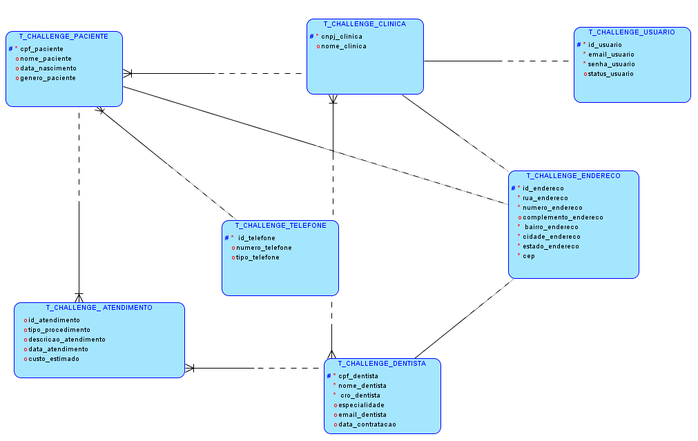
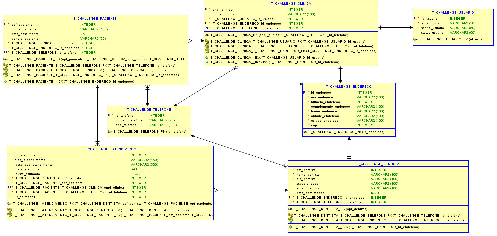

## Dental Insurance API

#### Visão Geral
A API Dental Insurance gerencia dados de clínicas odontológicas, pacientes, dentistas e atendimentos, servindo como base para um aplicativo móvel de armazenamento de informações sobre sinistros odontológicos. Ela permite operações CRUD para essas entidades, oferecendo um maior controle para administração dos dados. Essas informações serão usadas para rastrear sinistros relacionados aos atendimentos.

-- 
### Endpoints
1. Clínicas: 
#### GET /clinicas 
Descrição: Retorna uma lista de todas as clínicas cadastradas.

Exemplo de resposta:

``` 
[
  {
    "cnpj": "12345678000195",
    "nome": "OdontoClin",
    "usuario": {
      "id": 1,
      "email": "admin@odontoclin.com",
      "status": "ATIVO"
    },
    "endereco": {
      "id": 10,
      "rua": "Rua da Saúde",
      "numero": 123,
      "cidade": "São Paulo",
      "estado": "SP",
      "cep": "01000000"
    },
    "telefone": {
      "id": 1,
      "numero": "11987654321",
      "tipo": "Celular"
    }
  }
]

```

#### POST /clinicas
Descrição: Cadastra uma nova clínica.

Body (exemplo):

```
{
  "cnpj": "98765432000101",
  "nome": "Clínica Sorriso",
  "usuario": {
    "email": "contato@clinicasorriso.com",
    "senha": "senha123",
    "status": "ATIVO"
  },
  "endereco": {
    "rua": "Rua dos Dentistas",
    "numero": 456,
    "bairro": "Centro",
    "cidade": "Rio de Janeiro",
    "estado": "RJ",
    "cep": "20000000"
  },
  "telefone": {
    "numero": "21912345678",
    "tipo": "Fixo"
  }
}

```
Resposta (201 Created)


#### DELETE /clinicas/{cnpj}
Descrição: Deleta uma clínica pelo CNPJ.

Exemplo de URL:

```
/clinicas/987654320001013

```

2. Pacientes

#### GET /pacientes
Descrição: Retorna uma lista de todos os pacientes cadastrados.

Exemplo de resposta:

```
[
  {
    "cpf": "12345678901",
    "nome": "João da Silva",
    "dataNascimento": "1990-10-05",
    "genero": "Masculino",
    "clinica": {
      "cnpj": "12345678000195",
      "nome": "OdontoClin"
    },
    "endereco": {
      "rua": "Rua da Saúde",
      "numero": 123,
      "cidade": "São Paulo",
      "estado": "SP",
      "cep": "01000000"
    },
    "telefone": {
      "numero": "11987654321",
      "tipo": "Celular"
    }
  }
]

```

#### POST /pacientes
Descrição: Cadastra um novo paciente.

Body (exemplo):


```

{
  "cpf": "98765432101",
  "nome": "Maria Oliveira",
  "dataNascimento": "1985-05-15",
  "genero": "Feminino",
  "clinica": {
    "cnpj": "98765432000101",
    "nome": "Clínica Sorriso"
  },
  "endereco": {
    "rua": "Rua dos Pacientes",
    "numero": 789,
    "cidade": "São Paulo",
    "estado": "SP",
    "cep": "01020300"
  },
  "telefone": {
    "numero": "11912345678",
    "tipo": "Celular"
  }
}
```

#### DELETE /pacientes/{cpf}
Descrição: Deleta um paciente pelo CPF.

Exemplo de URL:
```
/pacientes/98765432101

```

Resposta (200 OK):

```
{
  "message": "Paciente deletado com sucesso."
}
```

3. Dentistas

#### GET /dentistas
Descrição: Retorna uma lista de todos os dentistas cadastrados.

Exemplo de resposta:

```
[
  {
    "cpf": "11223344556",
    "nome": "Dr. Pedro",
    "cro": "12345-SP",
    "especialidade": "Ortodontia",
    "email": "drpedro@odontoclin.com",
    "dataContratacao": "2023-02-01",
    "clinica": {
      "cnpj": "12345678000195",
      "nome": "OdontoClin"
    },
    "endereco": {
      "rua": "Rua dos Dentistas",
      "numero": 987,
      "cidade": "São Paulo",
      "estado": "SP",
      "cep": "01040500"
    },
    "telefone": {
      "numero": "11999999999",
      "tipo": "Celular"
    }
  }
]

```

#### POST /dentistas
Descrição: Cadastra um novo dentista.

Body (exemplo):

```
{
  "cpf": "22334455667",
  "nome": "Dra. Carla",
  "cro": "54321-SP",
  "especialidade": "Endodontia",
  "email": "drcarla@odontoclin.com",
  "dataContratacao": "2023-05-01",
  "clinica": {
    "cnpj": "12345678000195"
  },
  "endereco": {
    "rua": "Avenida Central",
    "numero": 1234,
    "bairro": "Centro",
    "cidade": "São Paulo",
    "estado": "SP",
    "cep": "01020304"
  },
  "telefone": {
    "numero": "11988887777",
    "tipo": "COMERCIAL"
  }
}

```
Resposta (201 Created)

#### DELETE /dentistas/{cpf}
Descrição: Deleta um dentista pelo CPF.

```
/dentistas/22334455667

```

Resposta (200 OK):

```
{
  "message": "Dentista deletado com sucesso."
}
```
4. Atendimentos

#### GET /Atendimentos
Descrição: Retorna uma lista de todos os atendimentos cadastrados.

Resposta de exemplo:

```
{
    "id": 1,
    "tipoProcedimento": "Consulta de Avaliação",
    "descricao": "Avaliação inicial do paciente para diagnóstico",
    "dataAtendimento": "2024-06-01T00:00:00.000+00:00",
    "custoEstimado": 150.0,
    "paciente": {
        "cpf": 12345678900,
        "nome": "John Doe",
        "dataNascimento": "1990-01-01T00:00:00.000+00:00",
        "genero": "Masculino",
        "clinica": {
            "cnpj": 12345678000195,
            "nome": "Clínica Exemplo",
            "usuario": {
                "id": 1,
                "email": "joao@example.com",
                "senha": "123456",
                "status": "ATIVO"
            },
            "endereco": {
                "id": 1,
                "rua": "Rua das Flores",
                "numero": 21,
                "complemento": "Ao lado da escola",
                "bairro": "Centro",
                "cidade": "São Paulo",
                "estado": "SP",
                "cep": 1234567
            },
            "telefone": {
                "id": 1,
                "numero": "(11) 98765-4321",
                "tipo": "RESIDENCIAL"
            }
        },
        "endereco": {
            "id": 2,
            "rua": "Rua Exemplo",
            "numero": 123,
            "complemento": "Apto 1",
            "bairro": "Bairro Exemplo",
            "cidade": "Cidade Exemplo",
            "estado": "Estado Exemplo",
            "cep": 12345678
        },
        "telefone": {
            "id": 2,
            "numero": "123456789",
            "tipo": "CELULAR"
        }
    },
    "dentista": {
        "cpf": 12345678901,
        "nome": "João da Silva",
        "cro": "12345",
        "especialidade": "Odontologia Geral",
        "email": "joao.silva@example.com",
        "dataContratacao": "2024-10-05T00:00:00.000+00:00",
        "clinica": {
            "cnpj": 12345678000195,
            "nome": "Clínica Exemplo",
            "usuario": {
                "id": 1,
                "email": "joao@example.com",
                "senha": "123456",
                "status": "ATIVO"
            },
            "endereco": {
                "id": 1,
                "rua": "Rua das Flores",
                "numero": 21,
                "complemento": "Ao lado da escola",
                "bairro": "Centro",
                "cidade": "São Paulo",
                "estado": "SP",
                "cep": 1234567
            },
            "telefone": {
                "id": 1,
                "numero": "(11) 98765-4321",
                "tipo": "RESIDENCIAL"
            }
        },
        "endereco": {
            "id": 3,
            "rua": "Rua Exemplo",
            "numero": 123,
            "complemento": "Apto 1",
            "bairro": "Centro",
            "cidade": "São Paulo",
            "estado": "SP",
            "cep": 12345678
        },
        "telefone": {
            "id": 3,
            "numero": "11987654321",
            "tipo": "CELULAR"
        }
    }
}

```
### POST /Atendimentos
Descrição: Cria um novo atendimento.

Exemplo de corpo da requisição:

```
{
  "tipoProcedimento": "Consulta de Avaliação",
  "descricao": "Avaliação inicial do paciente para diagnóstico",
  "dataAtendimento": "2024-06-01",
  "custoEstimado": 150.0,
  "paciente": {
    "cpf": 12345678900
  },
  "dentista": {
    "cpf": 12345678901
  }
}

```

#### DELETE /Atendimentos/{id}
Descrição: Deleta um atendimento com base no ID.


```
/atendimentos/1

```

Resposta (200 OK):

```
{
  "message": "Atendimento deletado."
}
```
# Testes no Postman 
Testes no postman: \
🔗 [teste-api-sprint-1.postman_collection](teste-api-sprint-1.postman_collection)

---

# Diagramas de Entidade e Relacionamento




#### Relacionamentos 

- Usuários estão associados a clínicas. Cada clínica pode ter um único administrador.
- Endereços são compartilhados entre clínicas, pacientes e dentistas, permitindo reutilização e evitando duplicação de dados.
- Pacientes e dentistas estão associados a clínicas, o que indica que eles estão vinculados a um único local de atendimento.
- Atendimentos estão diretamente relacionados a pacientes e dentistas, permitindo o rastreamento de qual atendimento foi realizado por qual dentista e para qual paciente.
- Telefones podem ser associados a clínicas, pacientes e dentistas, permitindo que cada entidade tenha seus números de contato.

Atualmente, as relações no backend Java não refletem completamente a estrutura 
do banco de dados. Nesta sprint, não foi possível mapear as relações de ManyToOne e OneToMany, 
tendo sido implementadas apenas as de OneToOne. Nas próximas sprints, será prioritário 
corrigir essas inconsistências para garantir um mapeamento mais adequado e a integridade dos dados.

---
# Diagrama de Classes

 -todo

---

# Protótipo
🔗 [Figma](https://www.figma.com/design/uNhAX2GxrdUcTTEWqlcRrb/Challenge-Odontoprev?node-id=0-1&m=dev&t=Tw48bZ3jF8djXHbU-1)

---
# Vídeo
🔗 -todo

---
 

# Equipe do Projeto

## 🚀 Integrantes

### 1. Alissa Silva Cezero - RM 553954
**Desenvolveu os entregáveis de**: 
  - COMPLIANCE & QUALITY ASSURANCE
  - DISRUPTIVE ARCHITECTURES: IOT, IOB & GENERATIVE IA
  - MOBILE APP DEVELOPMENT
    ### [GitHub/lissCez](https://github.com/lissCez)

### 2. Melissa Barbosa de Souza - RM 552535
**Desenvolveu os entregáveis de**:
- JAVA ADVANCED
- MASTERING RELATIONAL AND NON RELATIONAL DATABASE
  ### [GitHub/melissabsouza](https://github.com/melissabsouza) 

### 3. Nicolas Paiffer do Carmo - RM 554145
**Desenvolveu os entregáveis de**:
- ADVANCED BUSINESS DEVELOPMENT WITH .NET
- DEVOPS TOOLS E CLOUD COMPUTING
  ### [GitHub/NPaiffer](https://github.com/NPaiffer) 


